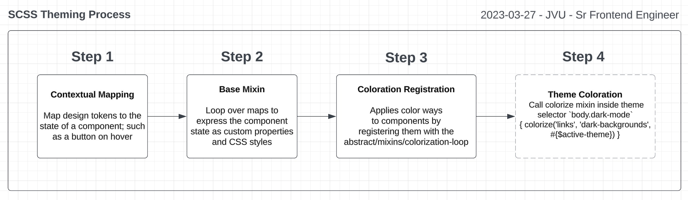

# Organization of the BEDS SCSS Framework

SCSS, or Sassy CSS, is a preprocessor scripting language that is interpreted or compiled into CSS. It adds features like variables, nesting, mixins, inheritance, and more to CSS, making it more powerful and easier to maintain. 

## Table of Contents

1. [SCSS Development Overview](#scss-development-overview)
1. [Main.scss (Entry Point)](#stylesmainscss)
1. [Folder Structure](#styles-folder-structure)
1. [Abstracts](#abstracts)
1. [Design Tokens](#design-tokens)
1. [Base Abstracts](#base-abstracts)
1. [Mixins](#mixins)
1. [Colorizing Components](#colorization-loopscss)
1. [Cobebase Abbreviations](#codebase-abbreviations)

## SCSS Development Overview
1. Develop Design Guidelines
    - Create UI Inventory
    - Design Atoms (Colors Palettes, Typography, Iconography, Spacing, etc.)
    - Design Components (Buttons, Links, Forms Inputs, Tables, Tabs, etc.)
    - Design Modules (Content Blocks - Heading + Text, Two-Column Image + Text)
1. Code Guidelines
    - Review design guidelines 
    - Identify atomic (base-level) design decisions and tokenize them
    - Map design tokens to components
    - Loop over maps to create custom CSS properties 
    - Loop over maps to create utility classes
1. Build components and modules leveraging utilities and custom properties
    - Context Map 
    - Base Mixins 
    - Coloration
    - Theming

## Styles/main.scss
The `styles/main.scss` file is the entry point for the SCSS. In the BEDS system, SCSS is organized and compiled in this order to maximize the cascading effects of CSS.

```scss
@use 'abstracts';
@use 'base';
@use 'layout';
@use 'components';
@use 'utilities'; 
```

## Styles Folder Structure

```bash
styles/
├── abstracts/        -------- Conceptual mechanisms that support the design system
│   ├── tokens/       -------- Design decisions expressed as variables
│   ├── base/         -------- Maps (data objects) that give design decisions context such as button states (hover, visited, focused, and active)
│   └── mixins/       -------- Functions and loops that convert maps into custom CSS properties and utility classes  
│
├── base/             -------- CSS Resets, root selector w/ custom properties, and base typography
├── layout/           -------- Layout Classes for sections, containers, rows, and columns
├── components/       -------- Buttons, Links, Carousels, etc
├── utilities/        -------- Utility classes (Margins, Padding, Dropshadows etc.)
│
└── main.scss         -------- Entry point for all abstract, base, and component styles
```

## **Abstracts**
A directory that contain SCSS code defining variables, mixins, functions, and placeholders. 

- [Design Tokens](#design-tokens)
- [Base](#base)
- [Mixins](#mixins)



## Design Tokens

As our product grows and evolves, design tokens make it easier to scale your design system. Instead of hardcoding specific values throughout your codebase, you can update design tokens centrally, making global changes more efficient and reducing the risk of inconsistencies.

Design tokens are typically defined as variables or constants and serve as the foundation for creating a consistent design language across an organization's products and platforms.

1. **Base Level Tokens**
    * Base level tokens define the most common units of measure throughout a design. 
    - **Location**
        * `src/styles/abstracts/tokens/_base-design-tokens.scss`
    - **Available Tokens**
        * Screen Size Breakpoints _(Desktop, Tablet, and Mobile)_
        * Content Width
        * Color Schemes _(Base, Light, and Dark)_
        * Typography _(Font Stacks, Font Size, Letter Spacing, and Line Height)_
        * Grids _(Columns)_
        * List Styles 
        * Vertical Spacing
        * Horizontal Spacing
        * Border Radius
        * Dropshadow
        * Transition Speeds
1. **Component Level Tokens**:
    * Component level tokens make variables for commonly used components available to the entire project.
    - **Location**
        * `src/styles/abstracts/tokens/_component-design-tokens.scss`
    - **Available Tokens**
        * Buttons 
        * Anchors
        * HTML Tables 
        * Content Toggles 
        * Content Switch 
        * Checkboxes
        * Radio Buttons

## Design Token Notation

### Sizing 

- Mobile  - sm, md, lg, and xl
- Tablet  - sm, md, lg, and xl
- Laptop  - sm, md, lg, and xl
- Desktop - sm, md, lg, and xl 

### Scale 

- [token type]-50 = 50%
- [token type]-75 = 75%
- [token type]-100 = 100% 
- [token type]-200 = 200% 

## Base Abstracts

Directory of maps (data objects) that give design decisions context such as button states (hover, visited, focused, active, and disabled).

```bash
abstracts/base/
    ├── _breakpoint-map.scss
    ├── _buttons-map.scss
    ├── _color-map.scss
    ├── _index.scss
    ├── _links-map.scss
    ├── _shadow-map.scss
    ├── _spacing-map.scss
    ├── _tables-map.scss
    ├── _toggle-switch-map.scss
    └── _typography-map.scss
```

In SCSS, a map is a data structure that stores key-value pairs, similar to an object or dictionary in other programming languages. Maps provide a way to organize data in a more structured manner, making it easier to manage and access related information.

SCSS maps are iterable; using functions we can iterate over maps, allowing you to perform operations on each key-value pair.

A SCSS map consists of pairs of keys and values enclosed within parentheses `()`. Each key-value pair is separated by a colon `:` Here's a basic example of a SCSS map: 

```scss
$buttonsOnContrastingBg: (
    'default-theme': (
        'primary': (
            'default': (
                'background-color': var(--primary-base),
                'color': var(--white-base),
            ),
            'visited': (
                'color': var(--white-base),
            ),
            'hover': (
                'background-color': var(--primary-dark-1),
                'color': var(--white-base),
            ),
            'active': (
                'background-color': var(--primary-light-2),
                'color': var(--white-base),
            ),
            'disabled': (
                'background-color': var(--primary-light-3),
                'color': var(--white-base),
            ),
        )
    )
)
```

## Mixins
Functions and loops that convert maps into custom CSS properties and utility classes  

```bash
abstracts/mixins/
    ├── _breakpoints.scss
    ├── _buttons.scss
    ├── _colorization-loop.scss
    ├── _colors.scss
    ├── _grids.scss
    ├── _index.scss
    ├── _links.scss
    ├── _spacing.scss
    ├── _tables.scss
    ├── _toggle-switch.scss
    └── _typography.scss
```

### Colorization-loop.scss

This SCSS file, styles/abstract/mixins/_coloration-loop.scss, defines a mixin called colorize that is used for applying color styles to different types of elements based on their background type and theme.

`@mixin colorize($elemType, $targetBackgroundType, $theme) { ... }`: This defines the colorize mixin, which accepts three parameters: $elemType (type of element), $targetBackgroundType (type of background), and $theme (theme configuration). 

**Example Usage**:
```scss
/*--- Color Scheme - Buttons on Contrasting Backgrounds, Styles ---*/

@include colorize('button', 'light-backgrounds', #{$active-theme});
@include colorize('button', 'dark-backgrounds', #{$active-theme});

/*--- Color Scheme - Anchors/Links on Contrasting Backgrounds, Styles ---*/

@include colorize('links', 'light-backgrounds', #{$active-theme});
@include colorize('links', 'dark-backgrounds', #{$active-theme});

/*--- Color Scheme - Tables  ---*/

@include colorize('tables', 'light-backgrounds', #{$active-theme});

/*--- Color Scheme - Toggle-switch on Light backgrounds ---*/

@include colorize('toggles', 'light-backgrounds', #{$active-theme});
```

## Codebase Abbreviations

|Symbol|Meaning|
|----|-----|
|sm|small|
|lg|large|
|md|medium|
|btn|button|
|pd|padding|
|mg|margin|
|ff|font-family|
|fs|font-size|
|lh|line-height|
|ls|letter-spacing|
|v|vertical|
|h|horizontal|
|mob|mobile|
|dsk|desktop|
|ltp|laptop|
|tbt|tablet|
|clr|color|
|bg|background|